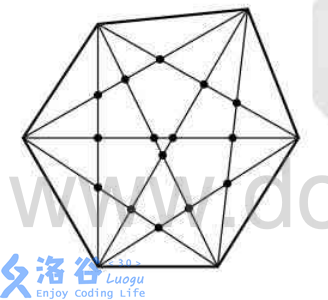

#题目描述
对于一个 n 个顶点的凸多边形，它的任何三条对角线都不会交于一点。请求出图形中对角线交点的个数。\
例如，6 边形：\

#输入格式
输入只有一行一个整数 n，代表边数。
#输出格式
输出一行一个整数代表答案。
#输入输出样例
输入\
3\
输出\
0\
输入\
6\
输出\
15
#说明/提示
数据规模与约定
对于 50% 的数据，保证 3≤n≤100。
对于 100% 的数据，保证3≤n≤10^5。